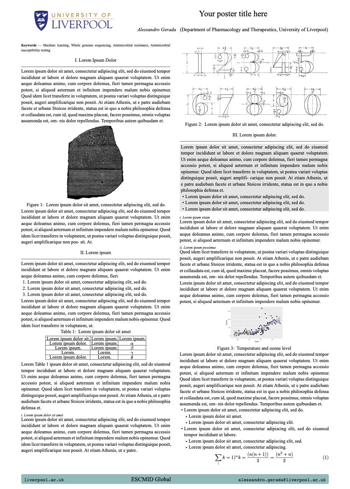

# Typst Poster Format

An academic poster template designed for Typst. Supports both horizontal and vertical posters. Originally created for Typst by Parth Parikh (https://github.com/pncnmnp/typst-poster) and adapted for Quarto.

## Installing

```bash
quarto use template quarto-ext/typst-templates/poster
```

This will install the format extension and create an example qmd file
that you can use as a starting place for your poster.

## Using

Specify poster size, authors/affiliation, and footer content using the YAML options of the `poster-typst` format:

```yaml
---
title: Your poster title here
format:
  poster-typst: 
    size: "33x46"
    num-columns: "2"
    poster-authors: "First Author, Second Author, Third Author"
    authors-font-size: 34
    title-font-size: 55
    departments: "Department of Pharmacology and Therapeutics, University of Liverpool"
    institution-logo: "./images/uol.png"
    univ-logo-scale: "75"
    footer-text: "ESCMID Global Vienna 2025"
    footer-url: "liverpool.ac.uk"
    footer-emails: "name@liverpool.ac.uk"
    footer-color: "81bbbb"
    body-font-size: 26
    keywords: ["Machine learning", "Whole genome sequencing", "Antimicrobial resistance", "Antimicrobial susceptibility testing"]
---
```

This is what a poster with the options specified above might look like:


